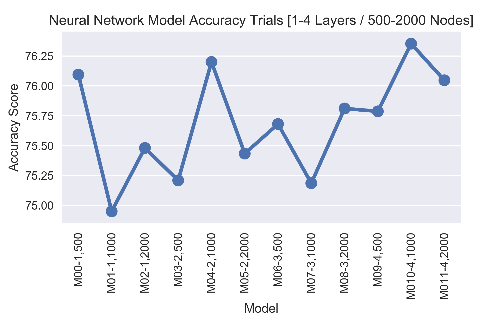
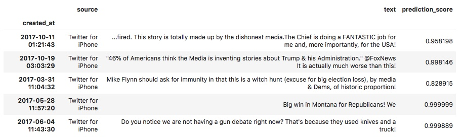
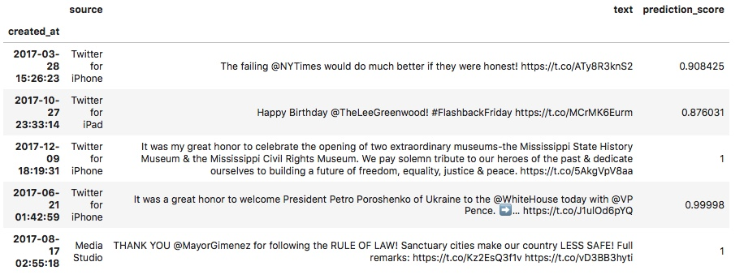

# Building a Trump Tweet Classifier with Keras
A small project written in Python that uses a Neural Network to predict
 when a tweet was written by Donald Trump, and when it was written by his staff.

#### Rationale
Prior to March 2018 Donald Trump had been using an unauthorised personal Android phone in his role at POTUS. Whilst a source of anxiety for his staff, for journalists and researchers this was particularly useful for distinguishing the words of the President himself, from those of the White House staff. With Twitter’s API providing information on the ‘source’ for each Tweet, it became a fair assumption that if the ‘source’ was Android, it was pure Trump. However in March 2017 Trump moved to an authorised iPhone, obscuring the origin of tweets specifically from his phone.

This small project explores the possibilities of using Neural Networks to identify Trump and Staff tweets based off the Tweet text content.

The project uses [Keras](https://keras.io) for model building and is a nice simple introduction to building, evaluating,
and using Neural Networks for binary classification of text.

Data for the project can be found at [this repo](https://github.com/Minyall/trump_tweet_classifier/blob/master/images/accuracy_scores.jpg?raw=true).

----------------------------------------------------------------------------------------------------------------------------------------------------

---
##### Predicted Trump Tweets

##### Predicted Staff Tweets

